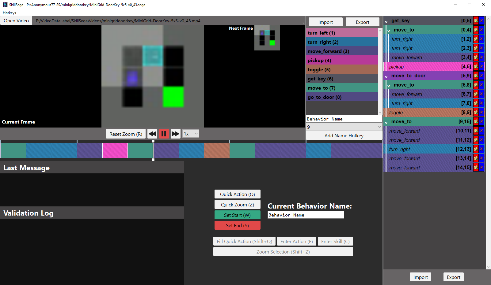

# SkillSega

## How to Use

`skillsega.py`

The main screen shows a 'Current Frame' and a 'Next Frame' of a loaded video. When the next frame shows that a behavior you are interested in has started or completed, you can mark the start or completion frames. Once both the start and ending frame have been selected, the 'Enter Action' and 'Enter Skill' are enabled. There are also some other buttons available for use.

The 'Add Name Hotkey' section allows for the entering of hotkeys (behavior names corresponding to a keybind) which make it faster to switch between behavior names when inputting data.

The 'File' button on the top right shows a complete list of hotkeys.

## Glossary

**Skills**: Behaviors that are expected to be learned. Are allowed to have children.

**Actions**: Behaviors that are expected to be already programmed. Are not allowed to have children.

## Installation

**Recommended Python Version:** 3.10.8

**Libraries:**

- https://pypi.org/project/PyQt5/
- https://pypi.org/project/opencv-python/
- https://numpy.org/
- https://grantjenks.com/docs/sortedcontainers/
- https://scikit-learn.org/
- https://minigrid.farama.org/
- https://pypi.org/project/keyboard/

See requirements.txt for specific installs and versions